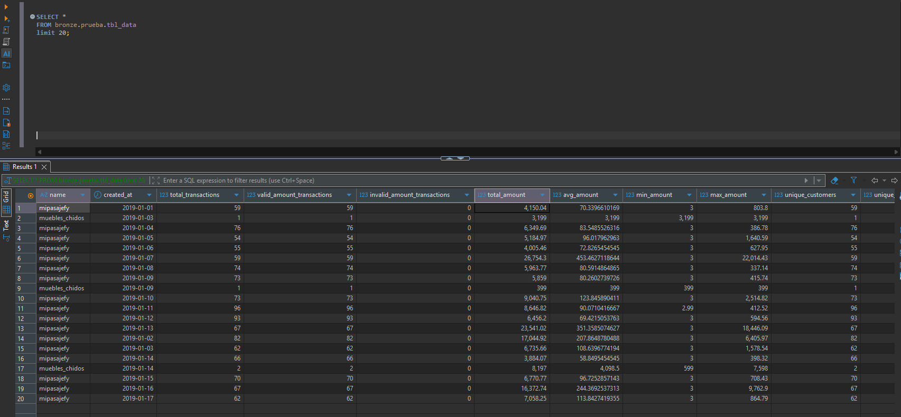

# Criterio de calidad de datos aplicado

Durante el desarrollo del proceso ETL se separaron las inconsistencias en dos grupos: correcciones tecnicas seguras e inconsistencias de negocio que requieren validacion

## Correcciones tecnicas seguras

Estas correcciones se aplican automaticamente porque no cambian el significado del dato, solo estandarizan su formato:

- Espacios al inicio y final
- Mayusculas y minusculas
- Espacios multiples
- Strings vacios convertidos a null
- Fechas parseables convertidas a tipo Date
- Filas completamente vacias
- Duplicados exactos

## Inconsistencias detectadas pero no corregidas automaticamente

Estas inconsistencias se detectan y se reportan, pero no se corrigen automaticamente porque requieren una regla de negocio validada:

- ``Ids`` nulos o no compatibles con formato hash
- ``Ids`` como `*******`
- ``Status`` fuera del catalogo esperado
- ``Names`` sospechosos o corruptos
- ``Company_id`` asociado a multiples ``names``
- ``Name`` asociado a multiples ``company_id``
- ``Amount`` extremadamente alto
- ``Paid_at`` menor que ``created_at``

### Criterio aplicado

No se aplican correcciones de negocio no validadas Las inconsistencias detectadas se encapsulan en la salida de calidad:

```text
bck-bronze/quality/observed_records.parquet
```

# Cuestionario

## 1 Para los ids nulos ¿Qué sugieres hacer con ellos ? 
Los ``IDs`` nulos no deben reemplazarse automaticamente ni imputarse con valores artificiales, ya que el enunciado indica que los IDs de usuarios estan ``enmascarados mediante hash``, si un identificador viene nulo, el generar un nuevo hash o copiar otro valor podria romper la trazabilidad historica y alterar la interpretacion del dato

### La estrategia que yo recomendaria es:
- Conservar el registro para trazabilidad
- Marcarlo con una bandera de calidad, por ejemplo ``is_null_id`` o ``is_invalid_id1``
- Enviar estos registros a una salida de observacion
- Revisar con el equipo fuente si el ``id`` nulo representa un error de origen, una transaccion anonima o un caso valido de negocio

En este ``pipeline`` de ejercicio 1, los registros con ``ids`` nulos o con formatos no esperados se consideran registros observados y se almacenan en la salida de calidad:

```text
bck-bronze/quality/observed_recordsparquet
```
 

## 2 Considerando las columnas name y company_id ¿Qué inconsistencias notas y como las mitigas?  

### Se detectan inconsistencias entre ``name`` y ``company_id``

En particular, existen casos donde un mismo ``name`` puede estar asociado a mas de un ``company_id``, y tambien posibles variantes o valores sospechosos en ``name``, por ejemplo nombres con patrones como ``mipas0xffff`` o ``mip0xffff``

Esto indica que ``name`` no debe tratarse como una llave unica confiable de compania El campo ``company_id`` parece ser un identificador mas estable, pero aun asi requiere validacion contra una tabla maestra

### La mitigacion aplicada es:

- Normalizar tecnicamente el campo ``name``
- convertir a minusculas
- remover espacios al inicio y final
- unificar espacios multiples
- No corregir automaticamente aliases o nombres sospechosos sin una regla de negocio validada
- Calcular ``unique_companies`` dentro de la agregacion para detectar si un mismo name y ``created_at`` agrupa mas de un ``company_id``
- Enviar registros sospechosos a una salida de calidad para revision

La correccion definitiva recomendada para una version productiva seria crear una tabla maestra de companias:

```text
company_id -> canonical_name
```
Con esa tabla se podria homologar el nombre comercial de forma controlada, sin aplicar supuestos dentro del ETL


## 3 Para el resto de los campos ¿Encuentras valores atípicos y de ser así cómo 
procedes?  
Si, durante la revision de la salida se identificaron valores atipicos y posibles inconsistencias en varios campos

### Campo amount

Se detectaron montos extremadamente altos y valores no validos como Infinity, los cuales pueden distorsionar metricas como ``total_amount``, ``avg_amount`` y ``max_amount``, en la consulta de validacion se observan montos muy superiores al comportamiento normal del dataset

#### La estrategia recomendada es:

- No eliminar automaticamente la transaccion completa
- Crear una columna limpia, por ejemplo ``amount_clean``
- Usar ``amount_clean`` para calcular metricas monetarias
- Marcar como observados los montos:
    - nulos;
    - negativos;
    - infinitos;
    - superiores a un umbral tecnico definido
- Guardar esos registros en la salida de calidad

De esta forma, la transaccion no se pierde, pero los valores invalidos no contaminan las metricas agregadas

### Campo status

Se detectaron valores validos como:
```text
paid
voided
refunded
charged_back
expired
pending_payment
pre_authorized
partially_refunded
```
Tambien se detectaron valores sospechosos como:
```text
0xFFFF
p&0x3fid
```
Estos valores no se corrigen automaticamente porque no existe una regla de negocio que confirme a que estado deberian mapearse En su lugar, se marcan como ``is_invalid_status`` y se envian a la salida de calidad

### Campos de fecha ``created_at`` y ``paid_at``
Se identifico la posibilidad de recibir fechas en diferentes formatos
 
Por ello, el proceso debe intentar parsear multiples formatos definidos por configuracion del pipeline, Si una fecha no puede convertirse correctamente, se marca como invalida

Ademas, se valida la relacion temporal entre fechas:
```text
paid_at < created_at
```
Si esto ocurre, el registro marca como incosistente mediante una bandare como
``is_paid_before_created`` 

## 4 ¿Qué mejoras propondrías a tu proceso ETL para siguientes versiones? 
``Para las futura versiones propondria:``  
### Separar salidas por nivel de calidad
- ``bck-bronze/master/:`` salida agregada principal
- ``bck-bronze/quality/: ``registros observados e inconsistencias
### Crear una tabla maestra de companias
- Usar ``company_id`` como llave principal
- Definir un `canonical_name`
- Evitar homologaciones manuales dentro del ETL
### Agregar procesamiento incremental
- Parametrizar el DAG con fechas de inicio y fin
- Procesar solo ventanas especificas de datos
### Particionar la salida Parquet
- Por fecha o periodo
- Esto mejoraria consultas en Trino y escalabilidad
### Agregar reportes de calidad
- Conteo de ids invalidos
- Conteo de status invalidos
- Conteo de montos invalidos
- Conteo de fechas invalidas
- Conteo de inconsistencias entre ``name`` y ``company_id``

### Desacoplar procesamiento y orquestacion

- En este ambiente el procesamiento con Polars corre dentro del ``airflow-worker``
Para un ambiente productivo, Airflow deberia orquestar un job externo, por ejemplo ``DockerOperator``, ``AWS Glue``, u ``OCI Data Flow``

5 Guardar una captura de pantalla como imagen, de la query con Trino usando 
DBeaver

Se deja adjunta la captura de ``tbl_data`` al consultar la tabla mediante DBeaver con la siguiente query

```sql
SELECT *
FROM bronze.prueba.tbl_data
limit 20;
```
#### Captura de la query


##### Descripcion de tabla ``tbl_data``

| Columna                       | Tipo esperado | Descripcion                                                                                                                                                                        |
| ----------------------------- | ------------- | ---------------------------------------------------------------------------------------------------------------------------------------------------------------------------------- |
| `name`                        | `varchar`     | Nombre normalizado del comercio o compania. Se utiliza como una de las llaves de agrupacion.                                                                                       |
| `created_at`                  | `date`        | Fecha de creacion de las transacciones. Se utiliza como segunda llave de agrupacion.                                                                                               |
| `total_transactions`          | `integer`     | Numero total de transacciones encontradas para ese `name` y `created_at`.                                                                                                          |
| `valid_amount_transactions`   | `integer`     | Numero de transacciones con monto valido para calculos monetarios.                                                                                                                 |
| `invalid_amount_transactions` | `integer`     | Numero de transacciones con monto invalido, por ejemplo valores nulos, negativos, infinitos o extremadamente altos.                                                                |
| `total_amount`                | `double`      | Suma total de los montos validos usando `amount_clean`. No utiliza montos marcados como invalidos.                                                                                 |
| `avg_amount`                  | `double`      | Promedio de los montos validos usando `amount_clean`.                                                                                                                              |
| `min_amount`                  | `double`      | Monto minimo valido dentro del grupo.                                                                                                                                              |
| `max_amount`                  | `double`      | Monto maximo valido dentro del grupo.                                                                                                                                              |
| `unique_customers`            | `integer`     | Numero de clientes unicos dentro del grupo, calculado con `id`. Como los ids estan enmascarados con hash, se usa para estimar clientes distintos sin exponer informacion sensible. |
| `unique_companies`            | `integer`     | Numero de `company_id` distintos dentro del mismo `name` y `created_at`. Si este valor es mayor a 1, puede indicar una inconsistencia entre `name` y `company_id`.                 |
| `invalid_id_count`            | `integer`     | Numero de registros dentro del grupo con `id` nulo, placeholder o formato no compatible con el hash esperado.                                                                      |
| `invalid_status_count`        | `integer`     | Numero de registros dentro del grupo con `status` fuera del catalogo esperado.                                                                                                     |
| `paid_before_created_count`   | `integer`     | Numero de registros donde `paid_at` es menor que `created_at`, lo cual indica una inconsistencia temporal.                                                                         |


